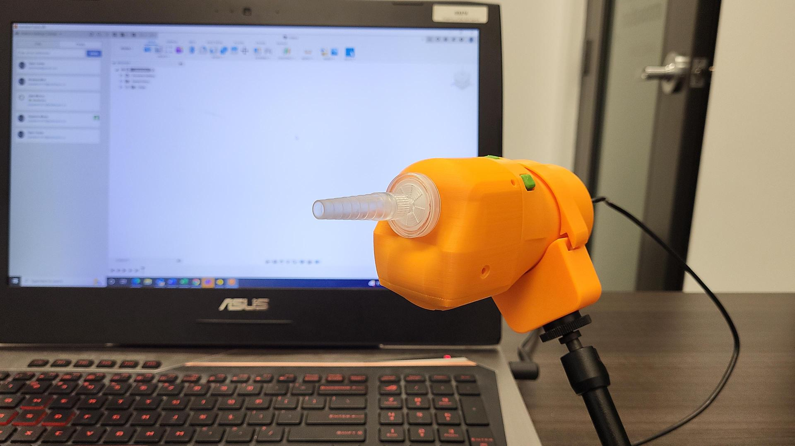

# LipSync - Beta Version

The LipSync is a mouth-operated sip and puff input device. It can emulate a mouse to provide access to a smartphone, tablet, or computer. The LipSync can also be configured as a joystick for use with gaming devices like the Xbox Adaptive Controller. 

The LipSync is Open Source Hardware. All the files, instructions, and code for the device are freely avaiable enabling the device to be built, used, and improved upon by anyone.

## Status
This version of the device is functional and has been tested by a small group of users. A number of opportunities for improvement have been identified and will be implemented during the summer of 2022.

## License

Everything needed or used to design, make, test, or prepare the LipSync is 
licensed under the CERN 2.0 Permissive license 
<https://ohwr.org/project/cernohl/wikis/Documents/CERN-OHL-version-2> (CERN-OHL-P) .

Accompanying material such as instruction manuals, videos, and other copyrightable works that are useful but not necessary to design, make, test, or prepare the LipSync are publshed under a Creative Commons Attribution-ShareAlike 4.0 license <https://creativecommons.org/licenses/by-sa/4.0/> (CC BY-SA 4.0)

## About Makers Making Change

Makers Making Change is an initiative of [Neil Squire](https://www.neilsquire.ca/), a Canadian non-profit that uses technology, knowledge, and passion to empower people with disabilities.

Makers Making Change is committed to creating and cultivating a network of volunteer makers who support people with disabilities in their communities through cost-effective Open Assistive Technology. MMC hosts a library of free, open-source designs complete with parts lists and build instructions.

 - Website: [www.MakersMakingChange.com](https://www.makersmakingchange.com/)
 - GitHub: [https://github.com/makersmakingchange](https://github.com/makersmakingchange)
 - Twitter: [@makermakechange](https://twitter.com/makermakechange)
 - Instagram: [@makersmakingchange](https://www.instagram.com/makersmakingchange)

### Contact Us

For technical questions, to get involved, or share your experience we encourage you to visit the [MMC Website](https://www.makersmakingchange.com/), [MMC Forum](https://makersmakingchange.com/forum), or contact info@makersmakingchange.com
