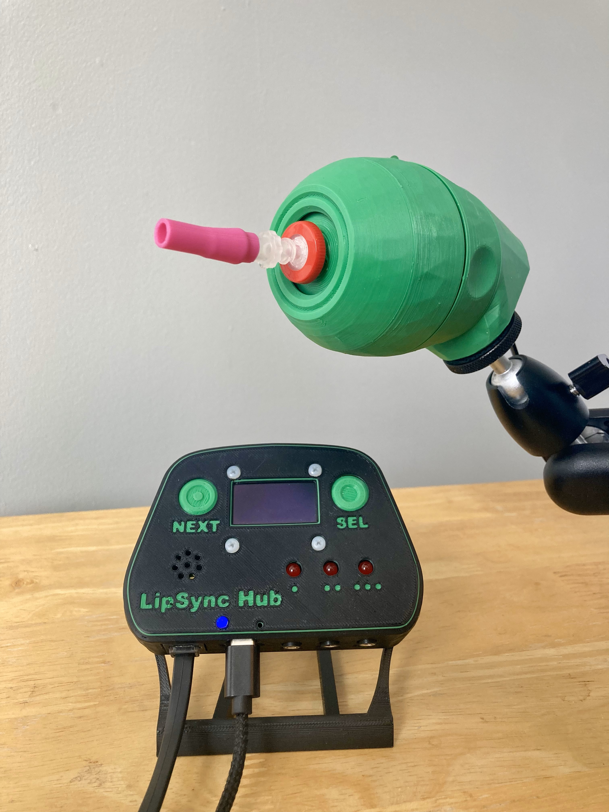

# LipSync

The LipSync is a mouth-operated sip-and-puff joystick that can emulate a mouse, wireless Bluetooth mouse, or gamepad. It enables people with disabililites that limit their mobility to control a computer, gaming console, smart phone, or tablet.

This most recent version, the LipSync 4.0, is made up of the LipSync Joystick and LipSync Hub. The Joystick is the primary user interface, and contains a low-force Hall-Effect joystick and sip and puff sensors. The Hub has a display that provides a graphical interface for independently adjusting settings, as well as it provides the connection to the host device and up to three external assistive switches with 3.5 mm jacks.

The device is comprised of off-the-shelf electronics and hardware, a custom PCB and 3D printed parts. The overall cost of materials (including materials required in bulk) for a single build is about $325 (plus shipping). In larger quantities, the cost of materials is closer to $175.

The LipSync is compatible with a range of host devices that are able to support a USB Mouse, a USB Gamepad and/or a Bluetooth Mouse. Compatible devices include PC and Mac computers and laptops, Android, iOS, and Windows smartphone and tablets, and the Xbox Adaptive Controller. 

The LipSync is Open Assistive Technology (OpenAT) and is certified as Open Source Hardware by the Open Source Hardware Association under the OSHWA UID [CA000046](https://certification.oshwa.org/ca000046.html). Under the terms of the open source hardware licenses, the LipSync may be built, used, and improved by anyone.  

Older versions of the LipSync are now obsolete. Documentation and design files are still available at the [LipSync Classic Repository.](https://github.com/makersmakingchange/OldLipSync)

Last updated: 2024-Feb-02

Makers Making Change Assistive Device Library Listing: [https://www.makersmakingchange.com/s/product/LipSync](https://www.makersmakingchange.com/s/product/lipsync/01tJR000000698fYAA)

## OpenAT Joysticks
This design is part of the [OpenAT Joystick Project](https://github.com/makersmakingchange/OpenAT-Joysticks), a collection of open source designs for digital access and adapted gaming. 

## How to Obtain the Device
### 1. Do-it-Yourself (DIY) or Do-it-Together (DIT)

This is an open-source assistive technology, so anyone is free to build it. All of the files and instructions required to build the device are contained within this repository. Refer to the Maker Guide below.

### 2. Request a build of this device

You may also submit a build request through the [MMC Library Page](https://www.makersmakingchange.com/s/product/LipSync/<mmc-salesforce-id>) to have a volunteer maker build the device. As the requestor, you are responsible for reimbursing the maker for the cost of materials and any shipping.

### 3. Build this device for someone else

If you have the skills and equipment to build this device, and would like to donate your time to create the device for someone who needs it, visit the [MMC Maker Wanted](https://makersmakingchange.com/maker-wanted/) section.

## Build Instructions

### 1. Read through the Maker Guide

The [Maker Guide](/Documentation/LipSync_Maker_Guide.pdf) contains all the necessary information to build this device, including tool lists, assembly instructions, programming instructions and testing instructions.

### 2. Order the Off-The-Shelf Components

The [Bill of Materials](/Documentation/LipSync_BOM.xlsx) lists all of the parts and components required to build the device. 

### 3. Print the 3D Printable components

All of the files and individual print files can be in the [/Build_Files/3D_Printing_Files](/Build_Files/3D_Printing/) folder.

### 4. Assemble the LipSync

Reference the Assembly Guide section of the [Maker Guide](/Documentation/LipSync_Maker_Guide.pdf) for the tools and steps required to build each portion.

## How to improve this Device
As open source assistive technology, you are welcomed and encouraged to improve upon the design. 

## Files
### Documentation
| Document             | Version | Link                                                                     | Notes             |
|----------------------|---------|--------------------------------------------------------------------------|-------------------|
| Design Rationale     | 4.0     | [LipSync_Design_Rationale](/Documentation/LipSync_Design_Rationale.pdf)  | In progress - part of future release  |
| Maker Guide          | 4.0     | [LipSync_Maker_Guide](/Documentation/LipSync_Maker_Guide.pdf)            |                   |
| Bill of Materials    | 4.0     | [LipSync_Bill_of_Materials](/Documentation/LipSync_BOM.csv)              |                   |
| User Guide           | 4.0     | [LipSync_User_Guide](/Documentation/LipSync_User_Guide.pdf)              |                   |
| Quickstart Guide     | 4.0     | [LipSync_Quickstart_Guide](/Documentation/LipSync_Quickstart_Guide.pdf)  |                   |
| Changelog            | 4.0     | [LipSync_Changelog](CHANGES.txt)                                         |                   |

### Design Files
 - [CAD Files](/Design_Files/CAD_Design_Files)
 - [PCB Files](/Design_Files/PCB_Design_Files)

### Build Files
 - [3D Printing Files](/Build_Files/3D_Printing_Files)
 - [PCB Files](/PCB_Build_Files/)
 - [Firmware Files](Build_Files/Firmware_Files)

## License
Copyright (c) 2024 Neil Squire / Makers Making Change.

This repository describes Open Hardware:
 - Everything needed or used to design, make, test, or prepare the LipSync is licensed under the [CERN 2.0 Weakly Reciprocal license (CERN-OHL-W v2) or later](https://cern.ch/cern-ohl ) .
 - All software is under the [GNU General Public License v3.0 (GPL-3.0)](https://www.gnu.org/licenses/gpl.html).
 - Accompanying material such as instruction manuals, videos, and other copyrightable works that are useful but not necessary to design, make, test, or prepare the LipSync are published under a [Creative Commons Attribution-ShareAlike 4.0 license (CC BY-SA 4.0)](https://creativecommons.org/licenses/by-sa/4.0/) .

You may redistribute and modify this documentation and make products using it under the terms of the [CERN-OHL-W v2](https://cern.ch/cern-ohl).
This documentation is distributed WITHOUT ANY EXPRESS OR IMPLIED WARRANTY, INCLUDING OF MERCHANTABILITY, SATISFACTORY QUALITY AND FITNESS FOR A PARTICULAR PURPOSE.
Please see the CERN-OHL-W v2 for applicable conditions.

Source Location: https://github.com/makersmakingchange/LipSync

## Attribution

The LipSync was designed by Neil Squire Society / Makers Making Change. The initial development of a 3D printable LipSync was supported by the Google Impact Challenge: Disabilities grant from Google.org. Further development was supported through the Government of Canada's Innovation Science and Economic Development [Accessible Technology Program](https://ised-isde.canada.ca/site/accessible-technology-program). These and other funders have also enabled Neil Squire / Makers Making Change to deploy numerous LipSyncs to users at reduced cost.

The latest design (V4.0) incorporates feedback and suggestions from numerous users, clinicians, and volunteer makers. In particular, 4.0.AlphaII was tested by the following users: Omar Al-azawi, Don Danbrook, Ean Price, Jim Ryan and Kaileen Selig.

V4.0 incorporates several commercially available open source hardware components:
 - [Adafruit TLV493D Triple-Axis Magnetometer - STEMMA QT / Qwiic](https://www.adafruit.com/product/4366). The PCB design is available under a CC-BY-SA 4.0 license at https://github.com/adafruit/Adafruit-TLV493D-PCB. 
 - [Adafruit LPS33HW Water Resistant Pressure Sensor - STEMMA QT](https://www.adafruit.com/product/4414). The PCB design is available under a CC-BY-SA 4.0 license at https://github.com/adafruit/Adafruit-LPS3X-PCB. 
 - [Adafruit LPS22 Pressure Sensor - STEMMA QT / Qwiic - LPS22HB](https://www.adafruit.com/product/4633). The PCB design is available under a CC-BY-SA 4.0 license at https://github.com/adafruit/Adafruit-LPS2X-PCB. 
 - [Adafruit 128X64 monochrome OLED Display Board](https://www.adafruit.com/product/938). The PCB design is available under a CC-BY-SA 4.0 license at https://github.com/adafruit/Adafruit-128x64-Monochrome-OLED-PCB.
 - [SparkFun Qwiic Adapter Board (DEV-14495)](https://www.sparkfun.com/products/14495). The PCB design is available under a CC-BY-SA 4.0 license at https://github.com/sparkfun/Qwiic_Adapter.   
 - [SparkFun RJ11 Breakout Board (BOB-14021)](https://www.sparkfun.com/products/14021). The PCB design is available under a CC-BY-SA 4.0 license at https://github.com/sparkfun/RJ11_Breakout. 

The LipSync firmware utilizes the Arduino development platform, an open-source electronics platform based on easy-to-use hardware and software. Arduino is developed and maintained by the Arduino community, and the project wouldn't be possible without their contributions.
Arduino is a registered trademark of Arduino AG. For more information about Arduino and to contribute to the community, visit the official Arduino website at www.arduino.cc.
The LipSync Firmware code uses several libraries:
 - [Adafruit_BusIO](https://github.com/adafruit/Adafruit_BusIO)  by Adafruit
 - [Adafruit_GFX](https://github.com/adafruit/Adafruit-GFX-Library) by Adafruit
 - [Adafruit_LPS2X](https://github.com/adafruit/Adafruit_LPS2X) by Adafruit
 - [Adafruit_LPS33HW](https://github.com/adafruit/Adafruit_LPS35HW) by Adafruit
 - [Adafruit_Sensor](https://github.com/adafruit/Adafruit_Sensor) by Adafruit
 - [Adafruit_SSD1306](https://github.com/adafruit/Adafruit_SSD1306) by Adafruit
 - [ArduinoJson](https://github.com/bblanchon/ArduinoJson) by Benoit Blanchon
 - [TLV493D-A1B6](https://github.com/Infineon/TLV493D-A1B6-3DMagnetic-Sensor) by Infineon Technologies

### Contributors
Designers:
 
 - Derrick Andrews, Neil Squire Society / Makers Making Change.
 - Stephan Dobri, Neil Squire Society / Makers Making Change.
 - Tyler Fentie, Neil Squire Society / Makers Making Change.
 - Milad Hajihassan, Neil Squire Society / Makers Making Change.
 - Jake McIvor, Neil Squire Society / Makers Making Change.
  - Stephen Moyer, Neil Squire Society / Makers Making Change.
 - Brad Wellington, Neil Squire Society / Makers Making Change.
 - Josie Versloot, Neil Squire Society / Makers Making Change.
 
## Open Source Hardware Certification

The LipSync has been certified as open source hardware by the Open Source Hardware Association under the OSHWA UID [CA000046](https://certification.oshwa.org/ca000046.html).

---

## About Makers Making Change

Makers Making Change is a program of [Neil Squire](https://www.neilsquire.ca/), a Canadian non-profit that uses technology, knowledge, and passion to empower people with disabilities.

Makers Making Change leverages the capacity of community based Makers, Disability Professionals and Volunteers to develop and deliver affordable Open Source Assistive Technologies.

 - Website: [www.MakersMakingChange.com](https://www.makersmakingchange.com/)
 - GitHub: [makersmakingchange](https://github.com/makersmakingchange)
 - Twitter: [@makermakechange](https://twitter.com/makermakechange)
 - Instagram: [@makersmakingchange](https://www.instagram.com/makersmakingchange)
 - Facebook: [makersmakechange](https://www.facebook.com/makersmakechange)
 - LinkedIn: [Neil Squire Society](https://www.linkedin.com/company/neil-squire-society/)
 - Thingiverse: [makersmakingchange](https://www.thingiverse.com/makersmakingchange/about)
 - Printables: [MakersMakingChange](https://www.printables.com/@MakersMakingChange)

### Contact Us
For technical questions, to get involved, or to share your experience we encourage you to [visit our website](https://www.makersmakingchange.com/) or [contact us](https://www.makersmakingchange.com/s/contact).
